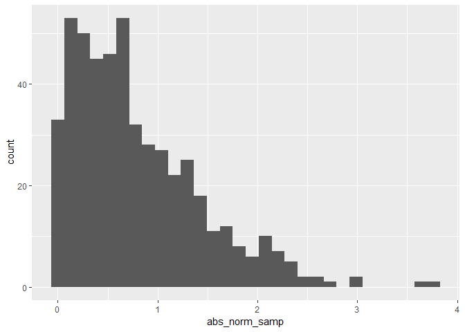

writing\_example
================
Sunny Siddique
September 17, 2018

I'm an R Markdown document!

Section 1
=========

Here's a **code chunk** that samples from a *normal distribution*:

``` r
samp = rnorm(100)
length(samp)
```

    ## [1] 100

Section 2
=========

I can take the mean of the sample, too! The mean is 0.0583745.

``` r
library(tidyverse)
```

    ## -- Attaching packages ----------------------------------------------------------- tidyverse 1.2.1 --

    ## v ggplot2 3.0.0     v purrr   0.2.5
    ## v tibble  1.4.2     v dplyr   0.7.6
    ## v tidyr   0.8.1     v stringr 1.3.1
    ## v readr   1.1.1     v forcats 0.3.0

    ## -- Conflicts -------------------------------------------------------------- tidyverse_conflicts() --
    ## x dplyr::filter() masks stats::filter()
    ## x dplyr::lag()    masks stats::lag()

``` r
la_df = tibble(
  norm_samp = rnorm(500),
  abs_norm_samp = abs(norm_samp)
)

ggplot(la_df, aes(x = abs_norm_samp)) + geom_histogram()
```

    ## `stat_bin()` using `bins = 30`. Pick better value with `binwidth`.



The median of the variable containing absolute values is 0.64. Formatting text
